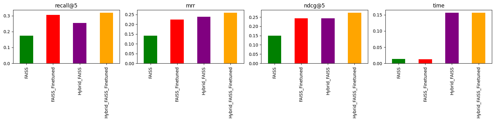
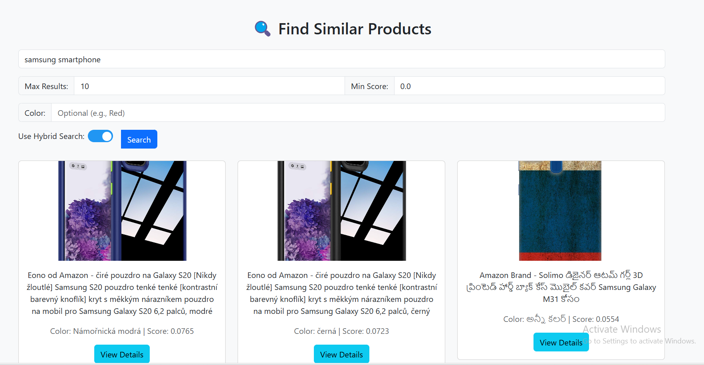
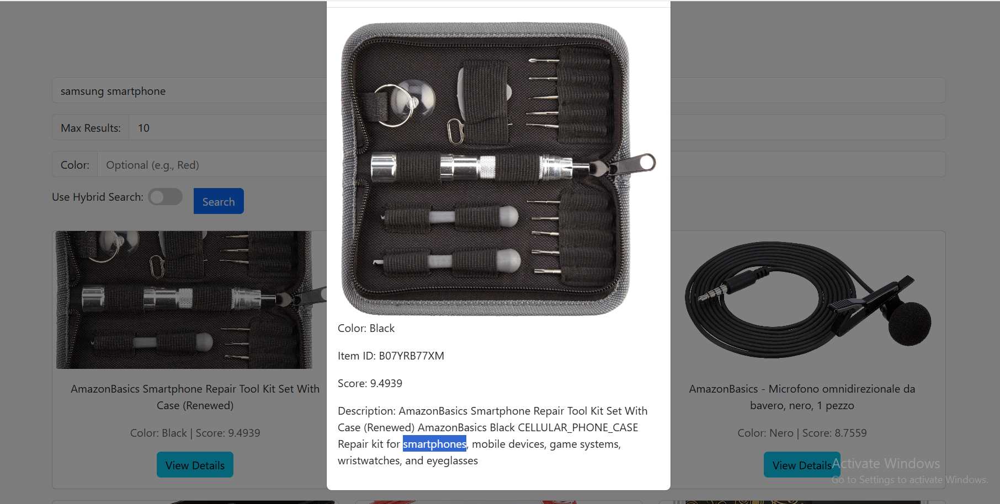

# itmo-lab-similar-product-nlp
## **Содержание**
- [Введение](#введение)
- [Процесс обработки данных](#процесс-обработки-данных)
  - [1. Предварительная обработка данных](#1-предварительная-обработка-данных)
  - [2. Создание FAISS индекса](#2-создание-faiss-индекса)
  - [3. Тонкая настройка модели](#3-тонкая-настройка-модели)
- [Методы бенчмаркинга](#методы-бенчмаркинга)
- [Метрики оценки](#метрики-оценки)
- [Результаты бенчмаркинга](#результаты-бенчмаркинга)
- [Заключение](#заключение)
- [🔎 Эксперименты и результаты](#🔎-эксперименты-и-результаты)

## **Введение**  
Эта система предназначена для оптимизации поиска продуктов путем сочетания методов поиска на основе векторных эмбеддингов и лексического поиска (BM25).  

**Основные цели проекта:**  
- Сравнение методов поиска: **FAISS, FAISS Fine-tuned, Hybrid FAISS, Hybrid FAISS Fine-tuned**.  
- Повышение точности поиска с помощью **тонко настроенного Sentence Transformer**.  
- Оценка производительности каждого метода с использованием **популярных метрик в Information Retrieval**.  

---

## **Процесс обработки данных**  

### **1. Предварительная обработка данных**  
Данные о продуктах извлекаются из файла `.gz`, затем нормализуются и объединяются в одно описание:  

**Исходные данные:**  
```json
{
    "item_id": "B07HL25ZQM",
    "item_name": "Nike Air Max 270",
    "brand": "Nike",
    "color": "Black",
    "product_type": "Shoes",
    "description": "Lightweight and comfortable sneakers"
}
```
**После предварительной обработки:**  
```text
Nike Air Max 270 Nike Black Shoes Lightweight and comfortable sneakers
```
**Цель:**  
- Объединить несколько атрибутов (**название, бренд, цвет, тип продукта, описание**) в одно предложение.  
- Нормализация данных помогает модели лучше понимать **семантику продукта**.  

---

### **2. Создание FAISS индекса**  
- Использование **Sentence Transformer (`paraphrase-MiniLM-L6-v2`)** для кодирования описания продукта в **векторные эмбеддинги**.  
- Нормализация векторов (`faiss.normalize_L2`) и сохранение в **FAISS индекс** для ускорения поиска.  
- FAISS использует **L2 distance** для поиска наиболее похожих продуктов.  

---

### **3. Тонкая настройка модели**  
- Данные для обучения создаются путем сопоставления каждого продукта с самим собой.  
- Использование **CosineSimilarityLoss** для тонкой настройки модели **Sentence Transformer (`all-MiniLM-L6-v2`)**.  
- **Epoch = 1, batch size = 16**.  
- После тонкой настройки **эмбеддинги продуктов обновляются в новом FAISS индексе**.  

---

## **Методы бенчмаркинга**  

| **Метод**                  | **Описание** |
|----------------------------|--------------------------------------------------|
| **FAISS**                  | Прямой поиск в FAISS индексе. |
| **FAISS Fine-tuned**       | FAISS с эмбеддингами из тонко настроенной модели. |
| **Hybrid FAISS**           | Комбинация FAISS + BM25 (BM25 переоценивает результаты из FAISS). |
| **Hybrid FAISS Fine-tuned**| Комбинация FAISS fine-tuned + BM25. |

**Примечание:** BM25 **не имеет доступа к исходным данным**, а только переоценивает **top-k результаты из FAISS**.  

---

## **Метрики оценки**  

| **Метрика**    | **Описание** |
|--------------|--------------------------------------------------|
| **Recall@K** | Доля случаев, когда правильный продукт появляется в top-K результатах. |
| **MRR**      | Среднее обратное ранжирование правильного продукта. |
| **nDCG@K**   | Точность результатов на основе важности ранжирования. |
| **Time**     | Среднее время обработки каждого запроса. |

**Формула для расчета MRR (Mean Reciprocal Rank):**  


Где **\( rank_i \)** это позиция первого правильного продукта в результатах поиска.  

---

## **Результаты бенчмаркинга**  

| **Метод**                  | **Recall@5** | **MRR** | **nDCG@5** | **Время (с)** |
|----------------------------|------------|------|--------|--------------|
| **FAISS**                  | 0.19       | 0.147583 | 0.158075 | 0.012741     |
| **FAISS Fine-tuned**       | 0.30       | 0.232917 | 0.249328 | 0.012169     |
| **Hybrid FAISS**           | 0.26       | 0.230583 | 0.238016 | 0.202096     |
| **Hybrid FAISS Fine-tuned**| **0.32**   | **0.254750** | **0.270974** | **0.196699** |

**Результаты показывают:**  
- **Тонкая настройка помогает FAISS значительно улучшить Recall, MRR и nDCG**.  
- **Гибридный поиск с BM25 повышает точность, но медленнее из-за необходимости переоценки результатов FAISS**.  
- **Hybrid_FAISS_Finetuned достигает лучших результатов с Recall@5 = 0.33, MRR = 0.26, nDCG@5 = 0.28**.  

---

## **Заключение: Рекомендуется использовать Hybrid_FAISS_Finetuned**  
- **Hybrid_FAISS_Finetuned имеет наивысшую точность** и может быть применен для **API поиска продуктов**.  
- Если требуется **более высокая скорость**, можно рассмотреть **FAISS Fine-tuned** вместо Hybrid.  

**График результатов:**  


---

## **🔎 Эксперименты и результаты**  

При тестировании с базовой моделью поиска можно заметить, что **точность с Hybrid Search значительно улучшается**:  

Например, при поиске `"Samsung Smartphone"`, **Hybrid Search возвращает именно продукты Samsung** (см. изображение).  

В то время как **BM25 показывает низкую точность**, возвращая нерелевантные продукты, так как он ищет только по ключевым словам без понимания семантики.  



-
-
Для более подробной информации о точности, см. **график результатов** и **демо видео** ниже:  

[](https://www.youtube.com/watch?v=CafWRVBLFGs)  

*(Нажмите на изображение, чтобы посмотреть демо видео на YouTube)*  

Для получения дополнительной информации, ознакомьтесь с файлом Python Notebook [здесь](/NPL_analystics.ipynb).

---

# itmo-lab-similar-product-nlp
# Product Search Benchmark & FAISS Indexing  

## **Table of Contents**
- [Introduction](#introduction)
- [Data Processing Workflow](#data-processing-workflow)
  - [1. Data Preprocessing](#1-data-preprocessing)
  - [2. Creating FAISS Index](#2-creating-faiss-index)
  - [3. Model Fine-tuning](#3-model-fine-tuning)
- [Benchmark Methods](#benchmark-methods)
- [Evaluation Metrics](#evaluation-metrics)
- [Benchmark Results](#benchmark-results)
- [Conclusion](#conclusion)
- [🔎 Experiments & Results](#🔎-experiments--results)

## **Introduction**  
This system is designed to optimize product search by combining vector embedding-based search methods and lexical search (BM25).  

**Main objectives of the project:**  
- Compare search methods: **FAISS, FAISS Fine-tuned, Hybrid FAISS, Hybrid FAISS Fine-tuned**.  
- Improve search accuracy using **fine-tuned Sentence Transformer**.  
- Evaluate the performance of each method using **popular metrics in Information Retrieval**.  

---

## **Data Processing Workflow**  

### **1. Data Preprocessing**  
Product data is extracted from a `.gz` file, then normalized and aggregated into a single description:  

**Original Data:**  
```json
{
    "item_id": "B07HL25ZQM",
    "item_name": "Nike Air Max 270",
    "brand": "Nike",
    "color": "Black",
    "product_type": "Shoes",
    "description": "Lightweight and comfortable sneakers"
}
```
**After Preprocessing:**  
```text
Nike Air Max 270 Nike Black Shoes Lightweight and comfortable sneakers
```
**Purpose:**  
- Combine multiple attributes (**name, brand, color, product type, description**) into a single sentence.  
- Normalize data to help the model learn **product semantics** more easily.  

---

### **2. Creating FAISS Index**  
- Use **Sentence Transformer (`paraphrase-MiniLM-L6-v2`)** to encode product descriptions into **vector embeddings**.  
- Normalize vectors (`faiss.normalize_L2`) and save them into a **FAISS Index** to speed up search.  
- FAISS uses **L2 distance** to find the most similar products.  

---

### **3. Model Fine-tuning**  
- Training data is created by matching each product with itself.  
- Use **CosineSimilarityLoss** to fine-tune the **Sentence Transformer (`all-MiniLM-L6-v2`)** model.  
- **Epoch = 1, batch size = 16**.  
- After fine-tuning, **product embeddings are updated in a new FAISS Index**.  

---

## **Benchmark Methods**  

| **Method**                  | **Description** |
|----------------------------|--------------------------------------------------|
| **FAISS**                  | Direct search in FAISS index. |
| **FAISS Fine-tuned**       | FAISS with embeddings from the fine-tuned model. |
| **Hybrid FAISS**           | Combination of FAISS + BM25 (BM25 re-evaluates results from FAISS). |
| **Hybrid FAISS Fine-tuned**| Combination of FAISS fine-tuned + BM25. |

**Note:** BM25 **does not access original data**, it only re-evaluates **top-k results from FAISS**.  

---

## **Evaluation Metrics**  

| **Metric**    | **Description** |
|--------------|--------------------------------------------------|
| **Recall@K** | The ratio of times the correct product appears in the top-K results. |
| **MRR**      | Mean Reciprocal Rank of the correct product. |
| **nDCG@K**   | Accuracy of results based on the importance of ranking. |
| **Time**     | Average processing time per query. |

**Formula for calculating MRR (Mean Reciprocal Rank):**  

Where **\( rank_i \)** is the position of the first correct product in the search results.  

---

## **Benchmark Results**  

| **Method**                  | **Recall@5** | **MRR** | **nDCG@5** | **Time (s)** |
|----------------------------|------------|------|--------|--------------|
| **FAISS**                  | 0.19       | 0.147583 | 0.158075 | 0.012741     |
| **FAISS Fine-tuned**       | 0.30       | 0.232917 | 0.249328 | 0.012169     |
| **Hybrid FAISS**           | 0.26       | 0.230583 | 0.238016 | 0.202096     |
| **Hybrid FAISS Fine-tuned**| **0.32**   | **0.254750** | **0.270974** | **0.196699** |

**Results show:**  
- **Fine-tuning helps FAISS significantly improve Recall, MRR, and nDCG**.  
- **Hybrid Search with BM25 increases accuracy but is slower due to re-evaluating FAISS results**.  
- **Hybrid_FAISS_Finetuned achieves the best results with Recall@5 = 0.33, MRR = 0.26, nDCG@5 = 0.28**.  

---

## **Conclusion: Use Hybrid_FAISS_Finetuned**  
- **Hybrid_FAISS_Finetuned has the highest accuracy** and can be applied for **product search API**.  
- If **faster speed** is needed, consider **FAISS Fine-tuned** instead of Hybrid.  

**Results Chart:**  


---

## **🔎 Experiments & Results**  

When testing with the basic search model, it can be seen that **accuracy with Hybrid Search improves significantly**:  

For example, when searching for `"Samsung Smartphone"`, **Hybrid Search returns exactly the Samsung products** (see image).  

Meanwhile, **BM25 shows poor accuracy** by returning irrelevant products, as it only searches based on keywords without understanding semantics.  

For more details on accuracy, refer to the **results chart** and **demo video** below:  

[](https://www.youtube.com/watch?v=CafWRVBLFGs)  

*(Click on the image to watch the demo video on YouTube)*  

For more information, refer to the Python Notebook file [here](/NPL_analystics.ipynb).
